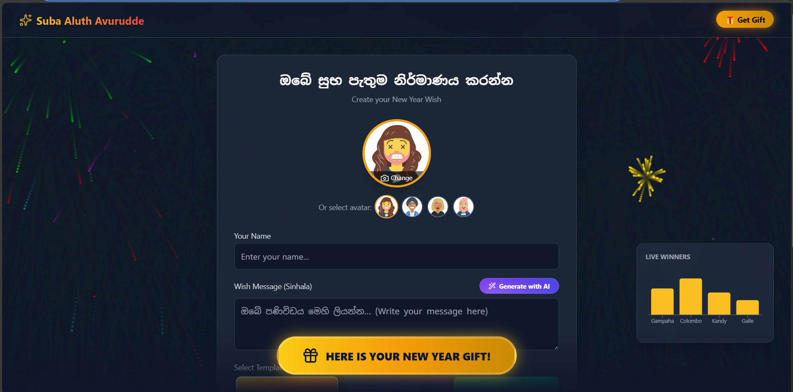

# 🎆 Suba Aluth Avurudde (Happy New Year) Wishing Platform
## 🎆 සුබ අලුත් අවුරුදු සුබපැතුම් පද්ධතිය



[English](#english) | [සිංහල](#සිංහල)

---

<a name="english"></a>
## 🇺🇸 English Version

A modern, professional, and viral New Year wishing platform built with **React**, **TypeScript**, and **Google Gemini AI**. This application allows users to create personalized New Year greetings in Sinhala, complete with AI-generated messages, custom avatars, and personal photo uploads.

### 🚀 Key Features
- **🤖 AI-Powered Wish Generation**: Integrated with **Google Gemini Pro** to generate beautiful, heart-touching New Year wishes in Sinhala.
- **🎨 Custom Greeting Cards**: Choose from multiple premium templates (traditional, modern, minimalist).
- **🖼️ Personalized Avatars & Uploads**: Select themed avatars or upload your own photo.
- **🎡 Spin Wheel Game**: Interactive "Golden Button" for a gamified prize experience.
- **🔗 Viral Sharing**: One-tap sharing to **WhatsApp** with unique shareable URLs.

### 🛠️ Tech Stack
- **Frontend**: React 19, Vite, TypeScript
- **AI**: Google Generative AI (Gemini)
- **Backend/DB**: Supabase
- **Image Hosting**: ImgBB API

---

<a name="සිංහල"></a>
## 🇱🇰 සිංහල අනුවාදය

**React**, **TypeScript** සහ **Google Gemini AI** තාක්ෂණයන් භාවිතා කරමින් නිෂ්පාදනය කරන ලද නවීන සහ වෘත්තීය මට්ටමේ සුබ අලුත් අවුරුදු සුබපැතුම් නිර්මාණ පද්ධතියකි. මෙහිදී පරිශීලකයින්ට කෘතිම බුද්ධිය (AI) මගින් සකස් කරන ලද සිංහල සුබපැතුම් පණිවිඩ, අලංකාර අවතාර (Avatars) සහ තමන්ගේම ඡායාරූප ඇතුලත් කර අලංකාර සුබපැතුම් පත් නිර්මාණය කරගත හැක.

### 🚀 ප්‍රධාන අංග
- **🤖 AI මගින් සුබපැතුම් නිර්මාණය**: Google Gemini Pro තාක්ෂණය භාවිතයෙන් ඔබේ නමට ගැලපෙන අර්ථවත් සිංහල සුබපැතුම් ස්වයංක්‍රීයව නිර්මාණය කිරීම.
- **🎨 විවිධ මෝස්තර (Templates)**: පාරම්පරික සහ නවීන මෝස්තර රැසකින් ඔබේ සුබපැතුම් පත තෝරාගැනීමේ හැකියාව.
- **🖼️ පුද්ගලික ඡායාරූප ඇතුලත් කිරීම**: පද්ධතියේ ඇති අවතාර භාවිතා කිරීම හෝ ඔබේම ඡායාරූපයක් එක් කිරීමේ හැකියාව.
- **🎡 තෑගි දිනුම් චක්‍රය (Spin Wheel)**: පරිශීලකයින් උනන්දු කරවන අන්තර්ක්‍රියාකාරී තෑගි දිනුම් ක්‍රීඩාව.
- **� පහසුවෙන් බෙදාගැනීම (Sharing)**: WhatsApp හරහා ඉතා වේගයෙන් ඔබේ සුබපැතුම් පත සමීපතමයින් වෙත යැවීමේ හැකියාව.

### 🛠️ තාක්ෂණික මෙවලම්
- **Frontend**: React 19, Vite, TypeScript
- **AI Integration**: Google Generative AI (Gemini)
- **Database**: Supabase
- **Image Hosting**: ImgBB API

---

## 📦 Getting Started / ආරම්භ කිරීමට

### Installation / ස්ථාපනය
1. **Clone repository:**
   ```bash
   git clone https://github.com/your-username/suba-aluth-avurudde.git
   ```
2. **Install dependencies:**
   ```bash
   npm install
   ```
3. **Environment Variables (.env.local):**
   ```env
   VITE_GEMINI_API_KEY=your_key
   VITE_SUPABASE_URL=your_url
   VITE_SUPABASE_ANON_KEY=your_anon_key
   VITE_IMGBB_API_KEY=your_imgbb_key
   ```
4. **Run:**
   ```bash
   npm run dev
   ```

<p align="center">Made with ❤️ for the New Year | නව වසර වෙනුවෙන් ආදරයෙන් ඉදිරිපත් කරයි</p>
